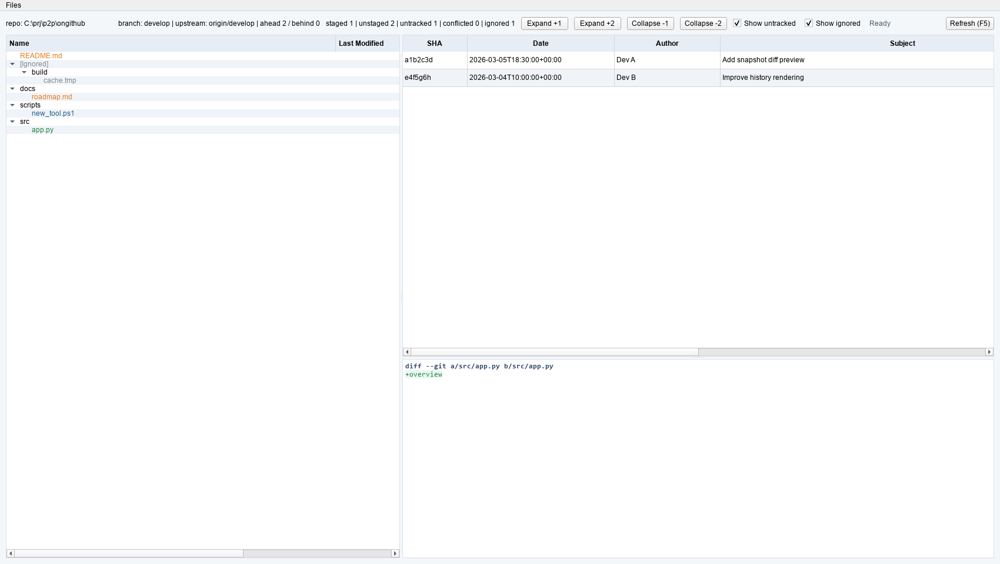
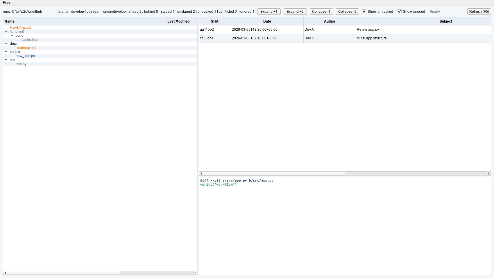
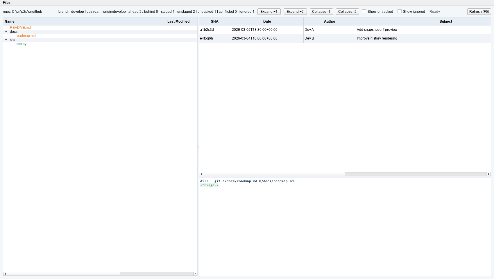

# git-statuz

PySide viewer for Git status and history.

## UI Walkthrough

1. Open a repository and review the status snapshot.

   

   Overview of changed files, branch context, and current repository health.

2. Inspect a selected file with commit history and diff details.

   

   Workflow state for drilling into a file's evolution before acting.

3. Apply filters to triage noisy change sets.

   

   Focused view for prioritizing actionable files and reducing review noise.

## Development (uv + Hatch)

This project uses `uv` for environment/dependency management and command execution, and `Hatch` for builds.

### Canonical commands

```powershell
uv sync --group dev
uv run pytest -q
uv run hatch build --clean
uv lock
```

`uv lock` must be run whenever dependencies change, and the updated `uv.lock` must be committed.

## CI expectations

- GitHub Actions runs on `windows-latest`.
- Python test matrix is `3.10`, `3.11`, and `3.12`.
- CI uses locked installs: `uv sync --locked --group dev`.
- Build job runs on Python `3.12` and uploads `dist/*` artifacts.

## Tooling policy

Use the `uv` + `Hatch` commands above for both local development and CI parity.

---

<!-- legal-disclaimer:start -->
## Legal Disclaimer

THIS SOFTWARE IS PROVIDED "AS IS" AND "AS AVAILABLE," WITHOUT WARRANTIES OF ANY KIND, WHETHER EXPRESS, IMPLIED, STATUTORY, OR OTHERWISE, INCLUDING, WITHOUT LIMITATION, ANY IMPLIED WARRANTIES OF MERCHANTABILITY, FITNESS FOR A PARTICULAR PURPOSE, TITLE, NON-INFRINGEMENT, ACCURACY, OR QUIET ENJOYMENT. TO THE MAXIMUM EXTENT PERMITTED BY APPLICABLE LAW, THE AUTHORS, CONTRIBUTORS, MAINTAINERS, DISTRIBUTORS, AND AFFILIATED PARTIES SHALL NOT BE LIABLE FOR ANY DIRECT, INDIRECT, INCIDENTAL, SPECIAL, CONSEQUENTIAL, EXEMPLARY, OR PUNITIVE DAMAGES, OR FOR ANY LOSS OF DATA, PROFITS, GOODWILL, BUSINESS OPPORTUNITY, OR SERVICE INTERRUPTION, ARISING OUT OF OR RELATING TO THE USE OF, OR INABILITY TO USE, THIS SOFTWARE, EVEN IF ADVISED OF THE POSSIBILITY OF SUCH DAMAGES. THIS SOFTWARE HAS BEEN DEVELOPED, IN WHOLE OR IN PART, BY "INTELLIGENT TOOLS"; ACCORDINGLY, OUTPUTS MAY CONTAIN ERRORS OR OMISSIONS, AND YOU ASSUME FULL RESPONSIBILITY FOR INDEPENDENT VALIDATION, TESTING, LEGAL COMPLIANCE, AND SAFE OPERATION PRIOR TO ANY RELIANCE OR DEPLOYMENT.
<!-- legal-disclaimer:end -->
